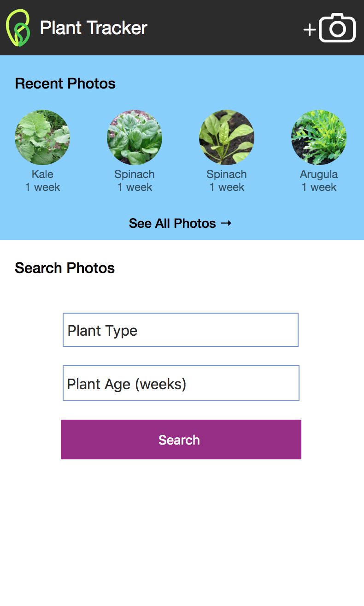
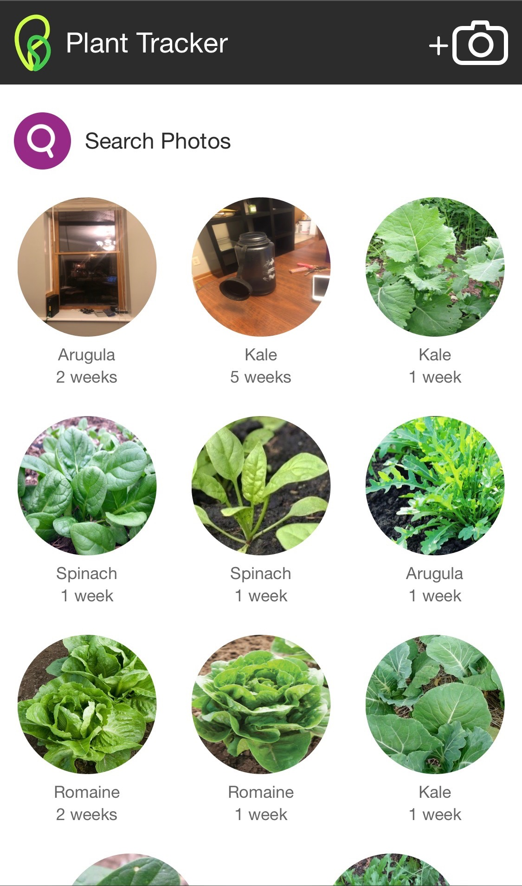

# Bowery Demo App #

## Live Site ##
You can see the site running at `https://d2pooavy3to05b.cloudfront.net`

## To Run ##
To run my code, make sure you have npm (I am running `6.1.0`).
Then, at the same level as `package.json`,
run `npm install`
and then `npm start`

 I mocked the API's using localStorage, and photos can be fairly space-intensive to store in localStorage. Using a real API to handle photo storage would solve this issue, but for now, running the app in Private Mode on your phone browser ensures you have the most space available and prevents the quota issue. So, please make sure you're using Private Mode on your safari if the add new photo feature isn't working. I double-checked this with 3 people's iPhones running IOS 12, so hopefully it should be ok!
 
## Usage Instructions ##
* New Plant - click on camera icon in top right corner
* Search - You can filter photos by plant type and/or plant age (or just see all plants)

## Future Improvements ##
* Annotations
* Swipe through photos in your search to quickly go through all plants that match your criteria
* Responsiveness -- more testing on desktop and ipads etc...

